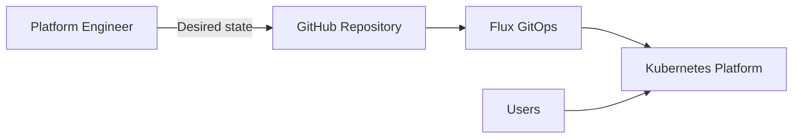

# k8s-platform-foundation

Production-oriented Kubernetes platform foundation for reproducible self-hosted
environments built around k3s, Flux GitOps, policy-as-code, observability,
progressive delivery and documented recovery procedures.

## Platform scope

The repository provides a reference implementation for operating a self-hosted
Kubernetes platform with:

- reproducible k3s bootstrap;
- Flux GitOps reconciliation;
- Traefik ingress;
- MetalLB load balancing;
- cert-manager automated TLS;
- ExternalDNS automation;
- SOPS and Age encrypted Secrets;
- Kyverno security policies;
- Prometheus, Grafana, Loki and Grafana Alloy;
- etcd and Velero backup workflows;
- node and cluster lifecycle automation;
- canary and blue-green progressive delivery;
- development, staging and production promotion;
- CI quality and security gates;
- architecture documentation;
- production incident runbooks.

## Architecture

The platform uses Git as the desired-state source and Flux as the reconciliation
engine.

Detailed architecture:

- [Platform overview](docs/architecture/platform-overview.md)
- [Component map](docs/architecture/component-map.md)
- [GitOps reconciliation](docs/architecture/gitops-flow.md)
- [Ingress, DNS and TLS](docs/architecture/traffic-flow.md)
- [Observability](docs/architecture/observability-flow.md)
- [Encrypted secrets](docs/architecture/secrets-flow.md)
- [Disaster recovery](docs/architecture/disaster-recovery-flow.md)
- [Progressive delivery](docs/architecture/progressive-delivery-flow.md)
- [Environment promotion](docs/architecture/environment-promotion-flow.md)

See [docs/architecture/README.md](docs/architecture/README.md).

## GitOps delivery model

The repository defines three workload environments:

    development -> staging -> production

Changes are promoted through Git rather than direct production mutation.

Production adds stricter resource and availability safeguards.

See [GitOps promotion](docs/gitops-promotion.md).

## Security model

The security baseline includes:

- restricted workload security controls;
- Kyverno admission policies;
- policy regression tests;
- live admission validation;
- SOPS-encrypted Secret manifests;
- Age key rotation and recovery;
- Gitleaks repository scanning;
- Trivy configuration scanning;
- Kubernetes manifest linting.

See:

- [Security](docs/security.md)
- [Threat model](docs/threat-model.md)
- [Policy testing](docs/policy-testing.md)
- [Secrets management](docs/secrets-management.md)

## Observability

The platform includes:

- Prometheus metrics;
- Grafana dashboards;
- Loki centralized logging;
- Grafana Alloy log collection;
- recording rules;
- platform alerts;
- rollout metrics for progressive delivery.

See [Observability](docs/observability.md).

## Backup and disaster recovery

Recovery capabilities include:

- k3s etcd snapshots;
- snapshot integrity verification;
- systemd scheduling;
- Velero backups;
- restore procedures;
- disaster recovery validation;
- recovery runbooks.

See:

- [Backup and recovery](docs/backup-and-recovery.md)
- [Disaster recovery](docs/disaster-recovery.md)
- [DR runbook](docs/disaster-recovery-runbook.md)

## Progressive delivery

Flagger provides:

- canary traffic shifting;
- blue-green deployment patterns;
- Prometheus rollout analysis;
- automated rollback;
- load testing;
- Traefik integration.

## Operations

Production runbooks cover:

- incident response;
- severity classification;
- initial triage;
- node failures;
- control-plane failures;
- Flux reconciliation failures;
- ingress, TLS and DNS failures;
- observability failures;
- backup and restore failures;
- encrypted Secret recovery;
- upgrades and rollback;
- on-call handover;
- post-incident review.

See [docs/runbooks/README.md](docs/runbooks/README.md).

## Validation

The repository includes CI and local validation for:

- YAML;
- Markdown;
- GitHub Actions;
- shell syntax and formatting;
- Kubernetes schemas;
- Kubernetes best practices;
- security configuration;
- Kyverno policy behavior;
- Kustomize rendering;
- integration scenarios;
- architecture documentation;
- runbook completeness;
- production readiness;
- release gates.

Run production readiness:

    make production-readiness

Run release gates:

    make release-gates

## Capabilities

See the full [platform capabilities matrix](docs/capabilities.md).

## Known limitations

This repository intentionally does not provision the underlying virtual
machines, physical hosts or cloud networking.

See [known limitations](docs/limitations.md).

## Requirements

Core runtime requirements include:

- Linux hosts compatible with k3s;
- systemd;
- curl;
- network connectivity between nodes;
- kubectl;
- Git;
- access to required external platform integrations.

Some administrative tooling is designed to run from PowerShell on Windows.

## Bootstrap

Install the control plane:

    make install

Join a worker node:

    export K3S_URL="https://CONTROL_PLANE_IP:6443"
    export K3S_TOKEN="REPLACE_WITH_NODE_TOKEN"

    make join

Validate the cluster:

    make validate

## Release

The current release version is stored in:

    VERSION

Release history:

    CHANGELOG.md

Release procedure:

    docs/release-process.md

## Project status

Version: **1.0.0 release candidate**

The v1.0 feature scope is complete.

The final release requires successful execution of all production readiness
and release validation gates before the `v1.0.0` tag is published.

## Documentation

- [Capabilities](docs/capabilities.md)
- [Production readiness](docs/production-readiness.md)
- [Release process](docs/release-process.md)
- [Known limitations](docs/limitations.md)
- [Roadmap](docs/roadmap.md)
- [Architecture](docs/architecture/README.md)
- [Production runbooks](docs/runbooks/README.md)

## License

MIT
