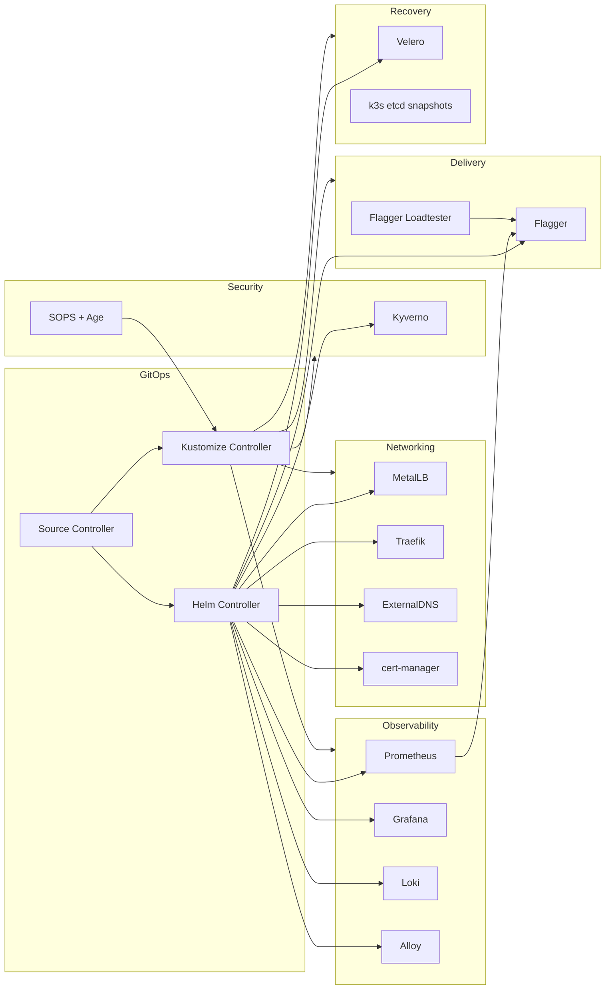

# Platform Component Map

## Responsibility boundaries

GitOps controllers manage reconciliation.

Networking components expose workloads and automate DNS and TLS.

Security components protect admission and encrypted configuration.

Progressive delivery components control rollout promotion and rollback.

Observability components provide metrics, dashboards and centralized logs.

Recovery components protect Kubernetes state and application resources.
