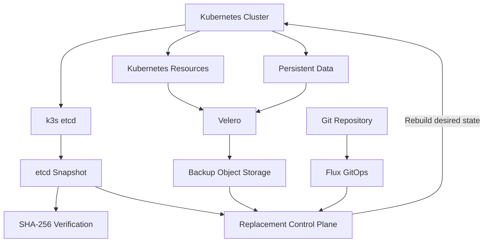

# Backup and Disaster Recovery Flow

## Recovery layers

The recovery architecture protects the platform at multiple levels:

- k3s etcd snapshots protect control-plane state;
- checksums validate snapshot integrity;
- Velero protects Kubernetes resources and persistent data;
- Git stores declarative desired state;
- Flux reconstructs platform components after cluster recovery.

Recovery procedures validate both restored state and subsequent GitOps
reconciliation.
