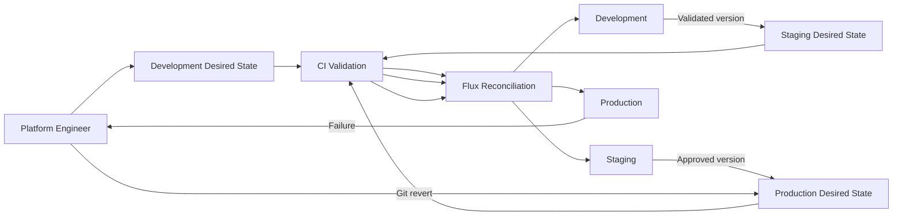

# Multi-Environment Promotion Flow

## Promotion model

Application versions move through environments using reviewed Git changes.

The intended sequence is:

    development -> staging -> production

Each target environment is rendered and validated before reconciliation.

Production includes additional resource and availability safeguards.

Rollback is performed through a Git revert followed by Flux reconciliation.
