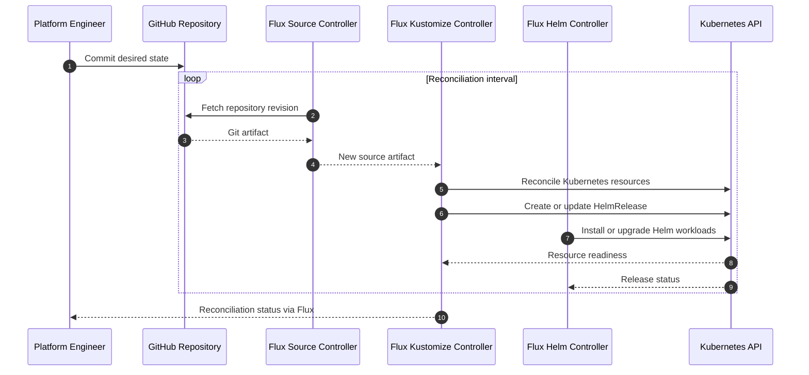

# GitOps Reconciliation Flow

## Reconciliation model

Flux continuously compares the desired state stored in Git with the state of
the Kubernetes cluster.

Normal platform changes are made through Git rather than direct manual
application of manifests.

Manual cluster operations are limited to:

- initial bootstrap;
- disaster recovery;
- emergency diagnostics;
- documented lifecycle operations;
- controlled secret bootstrap.
