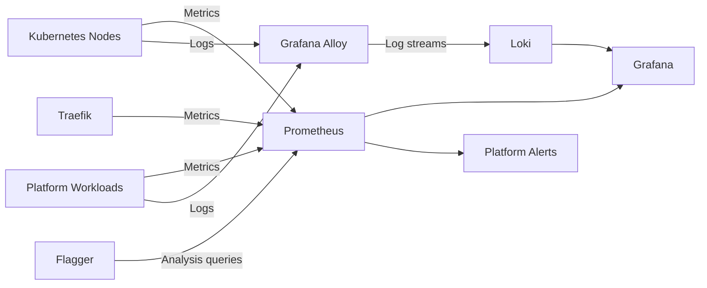

# Observability Data Flow

## Telemetry model

Prometheus collects infrastructure and application metrics.

Grafana Alloy forwards platform and workload logs to Loki.

Grafana provides a unified interface for metrics and logs.

Flagger queries Prometheus during progressive delivery to determine whether a
release should be promoted or rolled back.
