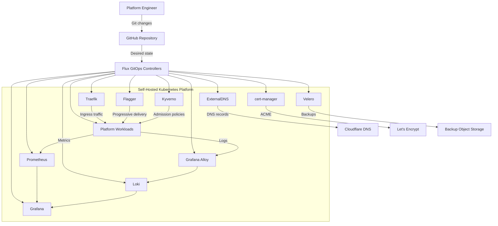

# Platform Architecture Overview

## Architecture principles

The platform is designed around the following principles:

- Git is the source of truth.
- Flux continuously reconciles desired state.
- Kubernetes resources are declarative and reproducible.
- Secrets are encrypted with SOPS and Age.
- Kyverno enforces security policy as code.
- Flagger controls progressive delivery.
- Prometheus, Grafana, Loki and Alloy provide observability.
- Velero and k3s snapshots provide recovery capabilities.
- Environment promotion is performed through Git changes.
- Manual cluster changes are reserved for bootstrap, recovery and diagnostics.
