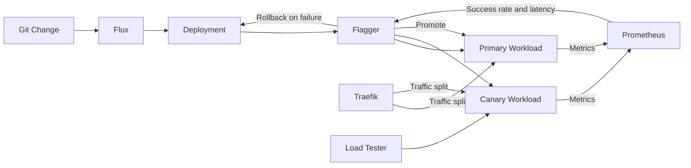

# Progressive Delivery Flow

## Promotion decision

Flagger progressively shifts traffic toward the candidate release.

Prometheus metrics provide objective rollout gates.

Failed thresholds stop promotion and trigger rollback.

Successful analysis promotes the candidate version to primary.
