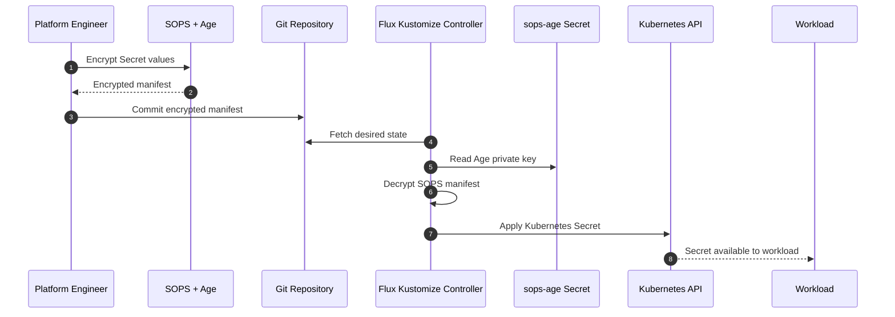

# Encrypted Secrets Flow

## Security boundary

The Age private key is never committed to Git.

Git stores encrypted Secret manifests only.

Flux performs decryption during reconciliation using the private key stored in
the cluster.

Plaintext Secret values exist only where required for Kubernetes runtime use.
