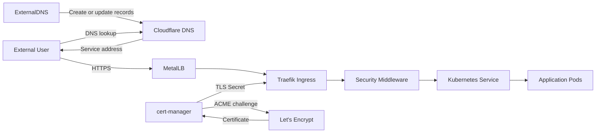

# Ingress, DNS and TLS Traffic Flow

## Request path

Public traffic resolves through Cloudflare DNS and reaches the Kubernetes
LoadBalancer address managed by MetalLB.

Traefik terminates TLS and applies platform middleware before forwarding traffic
to application Services.

ExternalDNS manages DNS records from Kubernetes resources.

cert-manager manages certificate lifecycle through Let's Encrypt.
